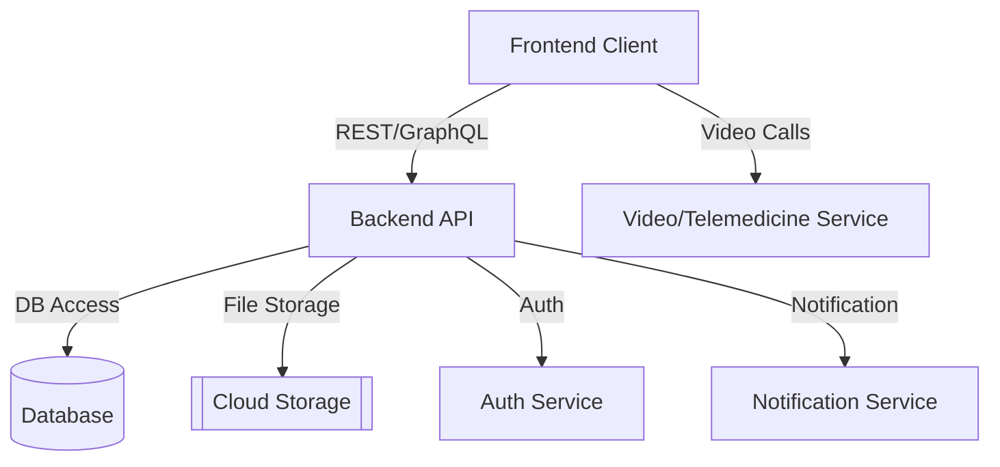

# mediconnect
# MediConnect

MediConnect is a modern healthcare platform that aims to connect patients, healthcare providers, and clinics seamlessly. With a focus on user experience, security, and interoperability, MediConnect empowers users to manage appointments, access records, and communicate efficiently within the healthcare ecosystem.

---

## Table of Contents

- [Motivation](#motivation)
- [Features](#features)
- [Architecture Overview](#architecture-overview)
- [Technologies Used](#technologies-used)
- [Getting Started](#getting-started)
- [API Endpoints](#api-endpoints)
- [Usage](#usage)
- [Contributing](#contributing)
- [Roadmap](#roadmap)
- [FAQ](#faq)
- [License](#license)
- [Contact](#contact)

---

## Motivation

In today's healthcare environment, patients and providers often face fragmented systems and inefficient communication. MediConnect was created to:

- Centralize health records for patients and practitioners
- Streamline appointment management
- Enable secure, real-time communication
- Support telemedicine and remote care
- Improve healthcare accessibility and efficiency

---

## Features

- **User Registration & Authentication**: Secure onboarding for patients and providers
- **Profile Management**: Update personal and professional information
- **Appointment Scheduling**: Book, reschedule, and cancel appointments with reminders
- **Medical Records**: Secure storage and sharing of health documents
- **Telemedicine**: Video and chat consultations
- **Messaging**: Encrypted communication between users
- **Search**: Find doctors, clinics, and specialties
- **Prescriptions**: Manage and renew prescriptions
- **Notifications**: Email and in-app alerts for key events
- **Multi-language Support**

---

## Architecture Overview



- **Frontend**: React.js SPA (or your chosen framework)
- **Backend**: Node.js/Express (or Django/Flask)
- **Database**: MongoDB/PostgreSQL
- **Authentication**: JWT/OAuth2
- **Cloud Storage**: AWS S3, GCP, or Azure Blob
- **Telemedicine**: Integration with [Twilio/Jitsi/Zoom APIs]

---

## Technologies Used

- **Frontend**: React.js, Redux, Tailwind CSS
- **Backend**: Node.js, Express, RESTful API
- **Database**: MongoDB (NoSQL)
- **Authentication**: JWT, OAuth2
- **DevOps**: Docker, Kubernetes, GitHub Actions
- **Cloud**: AWS/GCP/Azure
- **CI/CD**: Automated testing and deployment

---

## Getting Started

### Prerequisites

- Node.js v16+
- MongoDB or PostgreSQL instance
- Docker (optional, for containerization)
- [Optional] Python 3.x if using Django

### Installation

1. **Clone the repository:**
   ```bash
   git clone https://github.com/<your-username>/mediconnect.git
   cd mediconnect
   ```

2. **Install dependencies:**
   ```bash
   npm install
   ```

3. **Configure environment variables:**
   Copy `.env.example` to `.env` and fill in your credentials.

4. **Run the application:**
   ```bash
   npm start
   ```

5. **Run with Docker:**
   ```bash
   docker-compose up --build
   ```

---

## API Endpoints

| Method | Endpoint                | Description                       |
|--------|-------------------------|-----------------------------------|
| POST   | `/api/auth/register`    | Register a new user               |
| POST   | `/api/auth/login`       | User login                        |
| GET    | `/api/appointments`     | List user appointments            |
| POST   | `/api/appointments`     | Create a new appointment          |
| GET    | `/api/doctors`          | Search doctors/providers          |
| POST   | `/api/records/upload`   | Upload a medical record           |
| GET    | `/api/messages`         | Retrieve user messages            |
| POST   | `/api/messages/send`    | Send a message                    |
| POST   | `/api/video/start`      | Start a telemedicine session      |

*(See [API.md](API.md) for full documentation.)*

---

## Usage

- **Patients**: Register, find providers, book appointments, access records, and message doctors
- **Providers**: Manage schedules, consult patients, update records, and handle prescriptions
- **Admins**: Oversee users, manage clinics, view analytics

---

## Contributing

We welcome contributions!

1. Fork the repo and create your branch: `git checkout -b feature/your-feature`
2. Make your changes and commit: `git commit -am 'Add new feature'`
3. Push to the branch: `git push origin feature/your-feature`
4. Open a pull request

Please read [CONTRIBUTING.md](CONTRIBUTING.md) for more details.

---

## Roadmap

- [x] User authentication and roles
- [x] Appointment management
- [ ] Full-featured telemedicine
- [ ] Insurance claim integration
- [ ] Mobile app support (React Native)
- [ ] AI-powered health analytics

---

## FAQ

**Q: Is my data secure?**  
A: Yes. MediConnect uses industry-standard encryption and secure authentication.

**Q: Can I use MediConnect for my clinic?**  
A: Absolutely! Contact us for enterprise support.

**Q: Is there a mobile app?**  
A: Mobile support is coming soon.

---

## License

This project is licensed under the [MIT License](LICENSE).

---

## Contact

For support or business inquiries, please contact [itzsahilg1@gmail.com](mailto:itzsahilg1@gmail.com).

---

*This README is a template. Please update project-specific details as needed.*
